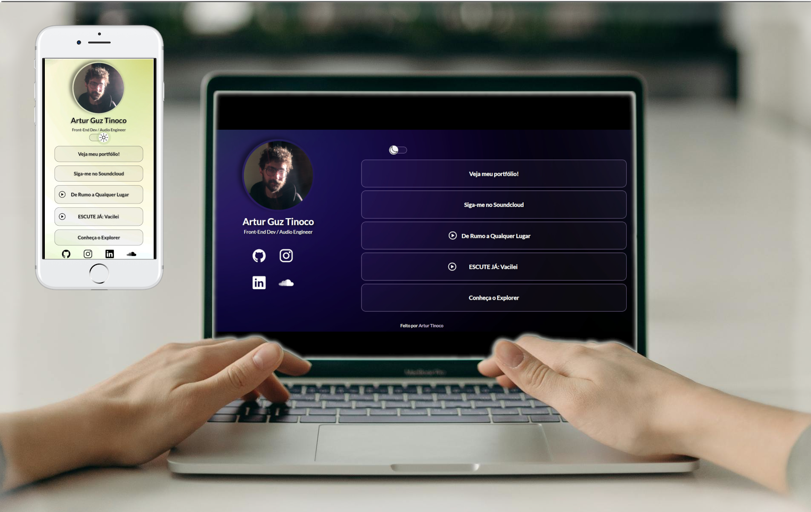

<h1 align="center"> Projeto ~ U-Link ~ </h1>

Projeto final do curso Discover promovido pela plataforma <a href="https://app.rocketseat.com.br/">Rocketseat</a>.

  <a href="#-Tecnologias">Tecnologias Utilizadas</a>&nbsp;&nbsp;&nbsp;|&nbsp;&nbsp;&nbsp;
  <a href="#-Conceito">Conceito do Projeto</a>&nbsp;&nbsp;&nbsp;|&nbsp;&nbsp;&nbsp;
  <a href="#memo-licença">Licença</a>

  

 

  

## 🤖 Tecnologias

O U-Link foi desenvolvido com as seguintes tecnologias:

 HTML5 
 CSS3 
 JavaScript 
 Git e Github  
 Gimp 
 Visual Studio Code

## 💻 Conceito

O U-Link é um agregador de links feito para direcionar o usuário à links personalizados como um cartão de visita virtual.

## :memo: Licença

Esse projeto está sob a licença MIT.

---

Feito por Artur Guz Tinoco
